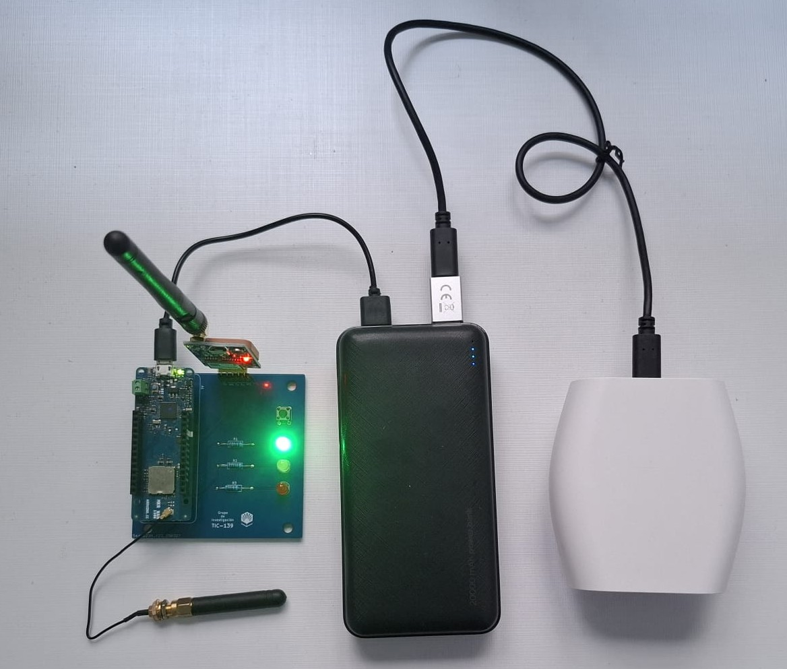
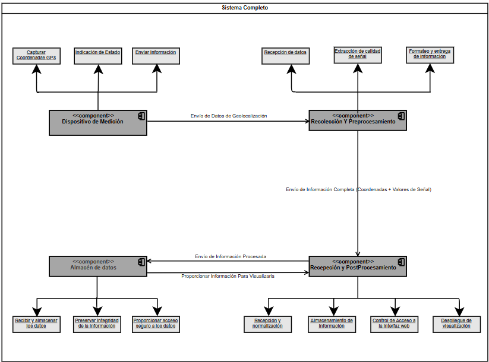
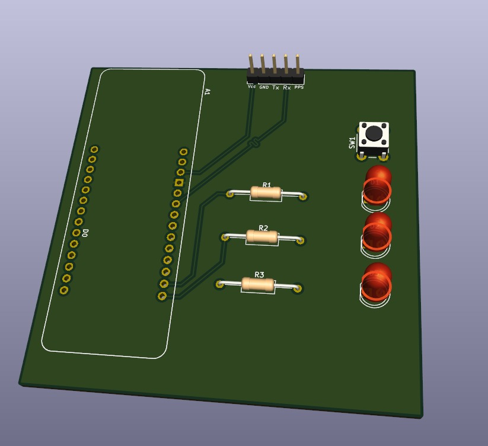
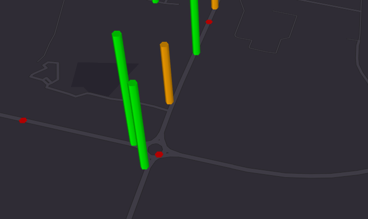
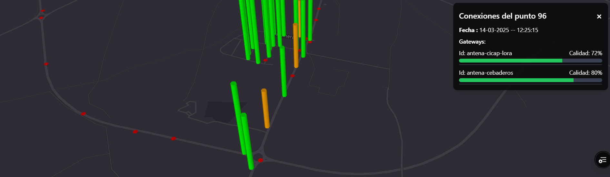

# Analizador de cobertura LoRaWAN

Trabajo Fin de Grado — Ingeniería Informática, Universidad de Córdoba (nota: 9,5/10)
Dirigido por Miguel Ángel Montijano Vizcaíno y Ezequiel Herruzo Gómez, en la línea de investigación de Diseño y Programación de Sistemas Empotrados.

Medir la cobertura real de una red LoRaWAN sobre el terreno es caro y lento con las soluciones comerciales existentes. Este proyecto propone una alternativa propia, de bajo coste, capaz de generar mapas de cobertura completos incluso en zonas donde todavía no hay cobertura desplegada.

<p align="center">
  
</p>

## Cómo funciona

<p align="center">
  
</p>

El sistema se compone de cuatro piezas:

1. **Dispositivo de medición** (`module1/`) — un Arduino MKRWAN 1300 + GPS sobre una PCB personalizada, alimentado por una batería externa de 20.000 mAh (+8h de autonomía en campo). Al pulsar un botón, toma la posición GPS y la envía por LoRaWAN.
2. **Recolección y preprocesamiento** — The Things Network recibe el envío y lo reenvía por webhook (`app/uplink-webhook/`) a este proyecto. Un gateway de soporte propio (TTIG) garantiza la recepción incluso en zonas sin cobertura externa.
3. **Cálculo de calidad** — el webhook calcula la calidad de la señal a partir del RSSI de cada gateway que recibió el mensaje, normalizando a una escala 0-100 según los estándares de LoRaWAN/TTN, y guarda el resultado en Supabase (PostgreSQL).
4. **Visualización** (`app/page.tsx`, `components/map/`) — un dashboard con mapa interactivo (Mapbox + deck.gl) que representa la cobertura como hexágonos codificados por color, consultando los datos vía `app/api/quality_points/`.

### PCB del dispositivo de medición

<p align="center">
  
</p>

### Dashboard de visualización

<p align="center">
  <br>
  
</p>

## Stack

- **Firmware**: C/C++ (Arduino IDE), librería MKRWAN, TinyGPS++
- **Backend**: Next.js (App Router), Supabase/PostgreSQL
- **Frontend**: React, Mapbox GL, deck.gl (HexagonLayer), Tailwind CSS
- **Red**: LoRaWAN, The Things Network

## Poner en marcha el proyecto web

```bash
npm install
cp .env.local.example .env.local   # y rellena tus valores
npm run dev
```

Variables de entorno necesarias (ver `.env.local.example`): `SITE_PASSWORD`, `NEXT_PUBLIC_SUPABASE_URL`, `NEXT_PUBLIC_SUPABASE_ANON_KEY`, `NEXT_PUBLIC_MAPBOX_TOKEN`.

El acceso al mapa está protegido por una contraseña simple comprobada en el servidor (`middleware.ts` + `app/api/login/`), pensada para un demo con acceso restringido, no para autenticación multiusuario.

## Firmware del dispositivo

Código en `module1/measure_device.ino`. Necesita un `module1/arduino_secrets.h` con tus propias credenciales de TTN — copia `arduino_secrets.h.example` y rellénalo; ese archivo está excluido del control de versiones a propósito.

## Documentación completa

En [`docs/QuesadaValleAlberto_MemoriaTFG.pdf`](docs/QuesadaValleAlberto_MemoriaTFG.pdf) está la memoria completa del TFG, con el análisis, diseño y pruebas detallados del sistema, además del **manual de usuario** y el **manual de código** como anexos — útil si quieres entrar en el detalle de cómo dar de alta un dispositivo en TTN o cómo está organizado el código.

## Licencia

MIT — ver [LICENSE](LICENSE).
